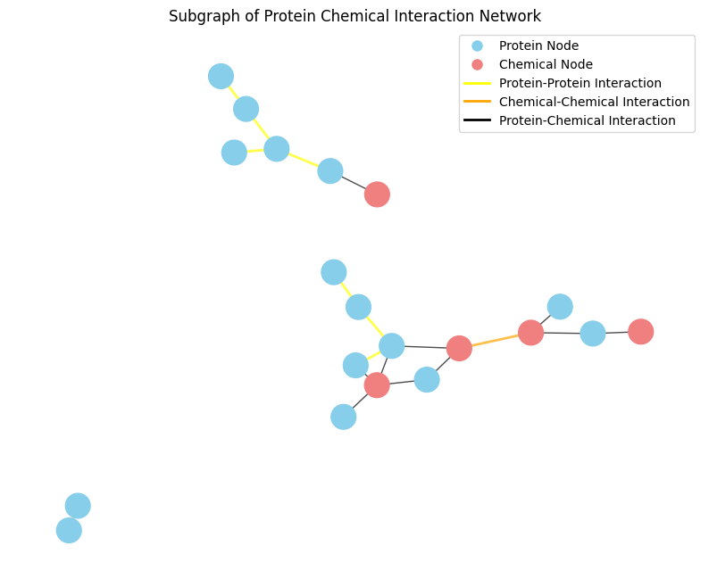
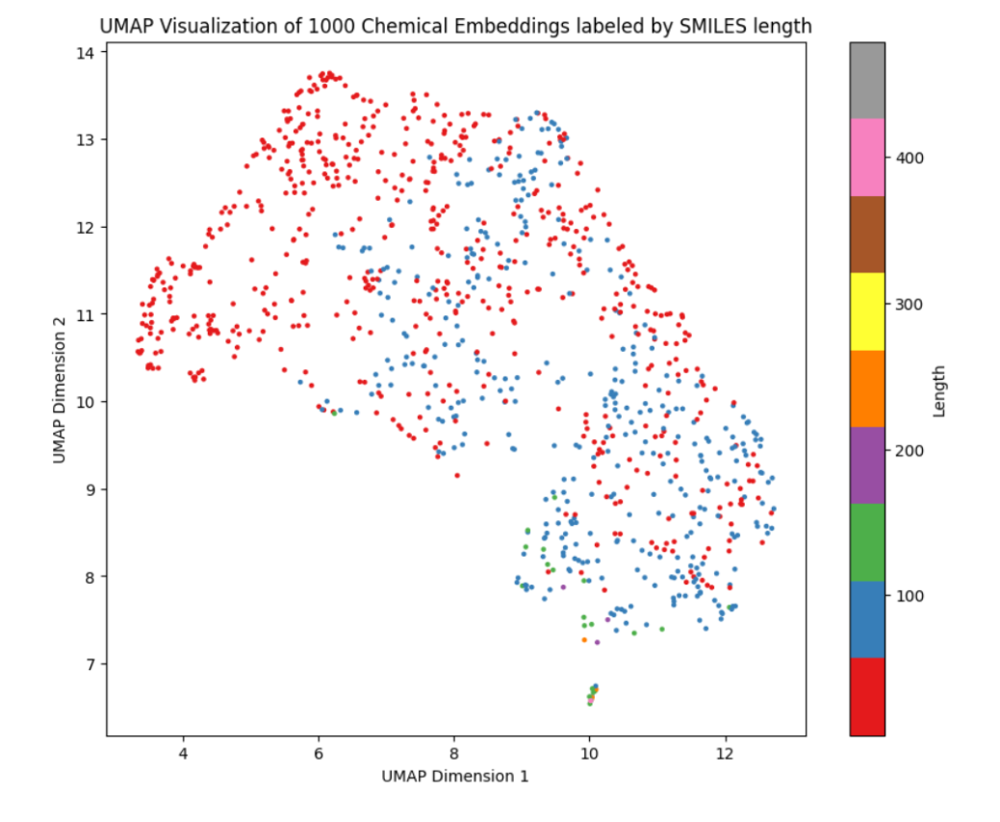
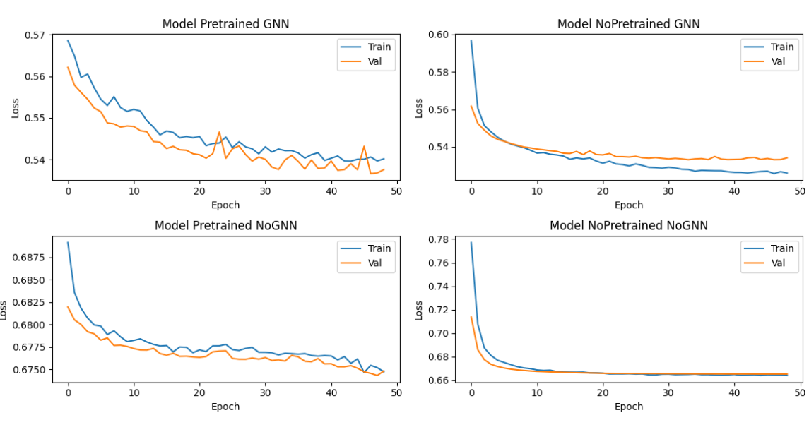
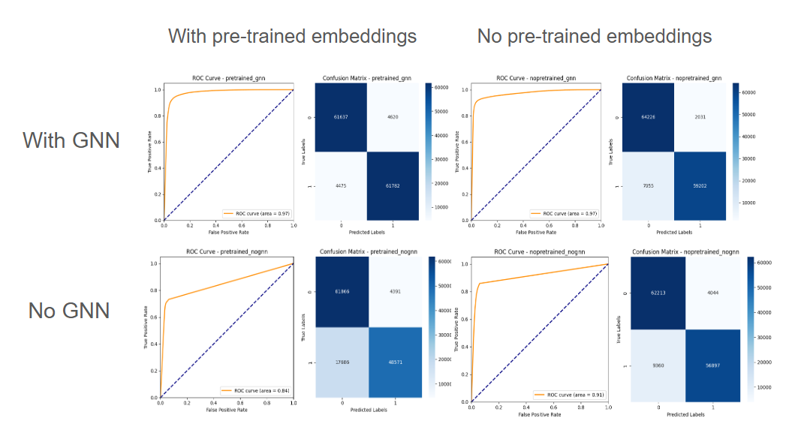

# Overview
### Chemical-Protein Interaction Prediction Using Graph Neural Network and Pretrained Embeddings
CS224W Project 

Author: Khoa Hoang, Charlie Jiang

Protein-chemical interaction (PCI) prediction have many potential applications, from unveiling novel
metabolic pathways to re-purposing drugs targets. Because of this, multiple machine learning models
have been developed for this problem. However, most methods aim to predict PCI from protein and
chemical structures. In this project, we aim to address the question of whether information about
protein-protein interaction, chemical-chemical interaction, and protein-chemical interaction could be
incorporate using graph neural network (GNN) to predict novel PCI. If success, network information
could then be combined with existing structured-based model to enhance model prediction accuracy.

Colab to run model [here](https://colab.research.google.com/drive/1jiRZbCMLlllrskGYg2Tb096aki7hZmIj?usp=sharing)
# Data

For this project, we will use

-  [STRING database](https://string-db.org) [2] 
-  [STITCH
database](http://stitch.embl.de) [3]

The dataset was preprocessed with the following criteria to reduce the graph size:
 - Only includes proteins and chemicals from Homo
sapiens. 
- Only physical interactions among proteins and chemicals are considered. 
- Only chemicals with inhibition effect with evidence scores > 500 are included in the network.

This results in heterogenous graph with 
- 7,273 protein nodes
- 12,442 chemical nodes
- 282,000 protein-protein edges
- 265,029 chemical-protein edges
- 305,135 chemical-chemical edges


# Model


```
Model(
  (protein_lin): MLP(
    (lin1): Linear(in_features=1536, out_features=64, bias=True)
    (lin2): Linear(in_features=64, out_features=64, bias=True)
    (laynorm1): LayerNorm((64,), eps=1e-05, elementwise_affine=True)
    (laynorm2): LayerNorm((64,), eps=1e-05, elementwise_affine=True)
    (drop1): Dropout(p=0.2, inplace=False)
    (drop2): Dropout(p=0.2, inplace=False)
  )
  (chemical_lin): MLP(
    (lin1): Linear(in_features=768, out_features=64, bias=True)
    (lin2): Linear(in_features=64, out_features=64, bias=True)
    (laynorm1): LayerNorm((64,), eps=1e-05, elementwise_affine=True)
    (laynorm2): LayerNorm((64,), eps=1e-05, elementwise_affine=True)
    (drop1): Dropout(p=0.2, inplace=False)
    (drop2): Dropout(p=0.2, inplace=False)
  )
  (protein_embs): Embedding(7273, 1536)
  (chemical_embs): Embedding(12442, 768)
  (gnn): GraphModule(
    (conv1): ModuleDict(
      (protein__protein_protein__protein): SAGEConv(64, 64, aggr=mean)
      (chemical__chemical_protein__protein): SAGEConv(64, 64, aggr=mean)
      (chemical__chemical_chemical__chemical): SAGEConv(64, 64, aggr=mean)
      (protein__rev_chemical_protein__chemical): SAGEConv(64, 64, aggr=mean)
    )
    (conv2): ModuleDict(
      (protein__protein_protein__protein): SAGEConv(64, 64, aggr=mean)
      (chemical__chemical_protein__protein): SAGEConv(64, 64, aggr=mean)
      (chemical__chemical_chemical__chemical): SAGEConv(64, 64, aggr=mean)
      (protein__rev_chemical_protein__chemical): SAGEConv(64, 64, aggr=mean)
    )
  )
  (classifier): Classifier()
```
# Ablation Study
To illustarte the effect of pretrained embeddings, GNN, and the nature of dataset on model performance, 8 different training schemes were deployed:

1. Training data percentage: 25%, Use pretrained embeddings: Yes, Use GNN: Yes
2. Training data percentage: 25%, Use pretrained embeddings: Yes, Use GNN: No
3. Training data percentage: 25%, Use pretrained embeddings: No, Use GNN: Yes
4. Training data percentage: 25%, Use pretrained embeddings: No, Use GNN: No
5. Training data percentage: 2.5%, Use pretrained embeddings: Yes, Use GNN: Yes
6. Training data percentage: 2.5%, Use pretrained embeddings: Yes, Use GNN: No
7. Training data percentage: 2.5%, Use pretrained embeddings: No, Use GNN: Yes
8. Training data percentage: 2.5%, Use pretrained embeddings: No, Use GNN: No

# Result

### Subgraph of the heterogenous graph


### Embeddings visualization (ChemBERTa)


### Train and Val Loss (Use 25% Train and Val data)


### AUC on Test set (Use 25% data to train)


### AUC results

| Train Size               | With Pretrained Embeddings | No Pretrain Embeddings | With Pretrained Embeddings (2.5%) | No Pretrain Embeddings (2.5%) |
|--------------------------|----------------------------|-------------------------|-----------------------------------|-------------------------------|
| **With GNN**             | 0.9714                    | 0.9675                 | 0.9354                            | 0.9309                       |
| **No GNN**               | 0.8438                    | 0.913                  | 0.8184                            | 0.8781                       |


# Code

- chemicals: containing script to embed SMILES using ChemBERTa
- proteins: containing script to embed protein sequence using ESM3
- scripts: scripts to preprocess data and generate misc plots

# Reference

[1] Ziniu Hu, Yuxiao Dong, Kuansan Wang, and Yizhou Sun. 2020. Heterogeneous Graph Transformer. In Proceedings of The Web Conference 2020 (WWW ’20). Association for Computing
Machinery, New York, NY, USA, 2704–2710. https://doi.org/10.1145/3366423.3380027

[2] Szklarczyk, Damian, et al. “The STRING Database in 2023: Protein-Protein Association Networks and Functional Enrichment Analyses for Any Sequenced Genome of Interest.” Nucleic Acids
Research, vol. 51, no. D1, Jan. 2023, pp. D638–46. PubMed, https://doi.org/10.1093/nar/gkac1000.

[3] STITCH 5: Augmenting Protein–Chemical Interaction Networks with
Tissue and Affinity Data | Nucleic Acids Research | Oxford Academic.
https://academic.oup.com/nar/article/44/D1/D380/2503089. Accessed 22 Oct. 2024.
[4] William L. Hamilton, Rex Ying, and Jure Leskovec. 2017. Inductive representation learning on
large graphs. In Proceedings of the 31st International Conference on Neural Information Processing
Systems (NIPS’17). Curran Associates Inc., Red Hook, NY, USA, 1025–1035